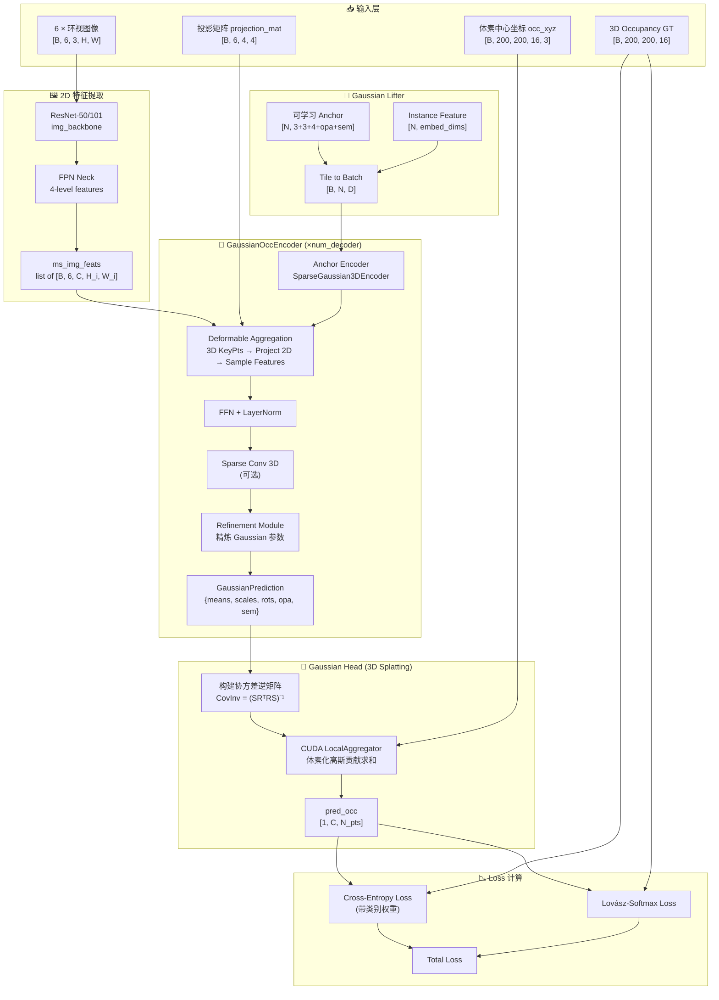

# GaussianFormer 源码解析与自定义数据适配指南

> **面向人群**: 自动驾驶感知算法工程师 / PyTorch & CUDA 落地开发者  
> **代码版本**: 基于当前工作区 `GaussianFormer` 仓库的 `main` 分支  
> **核心思想**: 用一组 3D Gaussian（均值、尺度、旋转、不透明度、语义）作为场景的稀疏表征，通过可微 splatting 渲染到 3D 体素网格上产出语义占据预测。

---

## 一、GaussianFormer 核心原理解析

### 1. 输入数据 (Input Data)

GaussianFormer 默认基于 **nuScenes** 数据集，由 `dataset/dataset.py` 中的 `NuScenesDataset` 类驱动。`__getitem__` 最终吐出一个 `dict`，经 `dataset/utils.py::custom_collate_fn_temporal` batch 化后送入模型。

#### 1.1 数据流水线最终产出的关键 Key

在 `config/_base_/surroundocc.py` 的 `pipeline` 中，数据依次经过：

| Pipeline Transform | 文件位置 | 作用 |
|---|---|---|
| `LoadMultiViewImageFromFiles` | `dataset/transform_3d.py:288` | 从硬盘读取 6 张环视图像 |
| `LoadOccupancySurroundOcc` | `dataset/transform_3d.py:474` | 加载 3D Occupancy GT（200×200×16 体素） |
| `ResizeCropFlipImage` | `dataset/transform_3d.py:75` | 图像增强 + 同步修改 `lidar2img` 矩阵 |
| `NormalizeMultiviewImage` | `dataset/transform_3d.py:142` | ImageNet 标准化 |
| `DefaultFormatBundle` | `dataset/transform_3d.py:14` | HWC → CHW + numpy→Tensor |
| `NuScenesAdaptor` | `dataset/transform_3d.py:59` | 组装 `projection_mat` 和 `image_wh` |

经过上述 pipeline，`train.py` 训练循环中：
```python
input_imgs = data.pop('img')                      # [B, N_cam, 3, H, W]
result_dict = my_model(imgs=input_imgs, metas=data)  # metas 是一个 dict
```

**`metas` dict 中关键 Key 和维度：**

| Key | 维度 / 类型 | 说明 |
|---|---|---|
| `projection_mat` | `[B, 6, 4, 4]` float32 | lidar2img 投影矩阵（含数据增强后的变换），**核心！模型通过此矩阵将 3D 高斯投射到 2D 特征图上** |
| `image_wh` | `[B, 6, 2]` float32 | 每张图的 `(W, H)`，用于归一化 2D 坐标到 `[0, 1]` |
| `occ_label` | `[B, 200, 200, 16]` int64 | 3D 语义占据真值，`17` 为 empty |
| `occ_xyz` | `[B, 200, 200, 16, 3]` float32 | 体素中心的世界坐标（Lidar 坐标系） |
| `occ_cam_mask` | `[B, 200, 200, 16]` bool | 有效体素掩码（`label != 0`） |
| `cam_positions` | `[B, 6, 3]` float32 | 6 个相机在 Lidar 坐标系下的位置 |
| `focal_positions` | `[B, 6, 3]` float32 | 6 个相机焦点在 Lidar 坐标系下的位置 |

#### 1.2 `projection_mat` 的构造链路

在 `dataset/dataset.py::get_data_info` 中：
```
lidar2global → img2global → lidar2img = inv(img2global) @ lidar2global  # [4, 4]
```
然后在 `dataset/transform_3d.py::ResizeCropFlipImage` 中：
```
lidar2img[i] = ida_mat @ lidar2img[i]   # ida_mat: 含 resize/crop/flip 的 [4, 4] 变换
```
最后在 `NuScenesAdaptor` 中 `stack` 成 `[6, 4, 4]` 的 `projection_mat`。

---

### 2. 模型结构 (Model Architecture)

顶层模型为 `model/segmentor/bev_segmentor.py::BEVSegmentor`，继承 `CustomBaseSegmentor`。

#### 2.1 前向传播完整链路

```python
# bev_segmentor.py::forward()

# Step 1: 2D Backbone + FPN
outs = self.extract_img_feat(imgs, ...)
# imgs: [B, 6, 3, H, W] → ResNet50/101 → FPN → ms_img_feats: list of [B, 6, C, H_i, W_i]

# Step 2: Lifter — 生成 3D Gaussian 查询
outs = self.lifter(ms_img_feats, metas, ...)
# 输出: rep_features [B, N_anchor, embed_dims], representation [B, N_anchor, D_anchor]

# Step 3: Encoder — 迭代精炼
outs = self.encoder(representation, rep_features, ms_img_feats, metas, ...)
# 输出: representation = list[dict{'gaussian': GaussianPrediction}]

# Step 4: Head — 3D Gaussian Splatting → 语义占据
outs = self.head(representation, metas, ...)
# 输出: pred_occ, sampled_label, sampled_xyz, final_occ, ...
```

#### 2.2 各模块详解

**A) 2D Backbone + FPN** (`model/segmentor/base_segmentor.py`)

- Backbone: `ResNet-50` 或 `ResNet-101`（可带 DCN）
- Neck: `FPN`，输出 `num_levels=4` 层特征
- 输出: `ms_img_feats` — 多尺度特征 list，每个 shape `[B, 6, embed_dims, H_i, W_i]`

**B) GaussianLifter** (`model/lifter/gaussian_lifter.py`)

初始化 `N_anchor` 个 3D Gaussian（随机初始化），每个 Gaussian 的参数向量：
```
anchor = [xyz(3), scale(3), rotation(4), opacity(0或1), semantics(semantic_dim)]
```
- `nuscenes_gs144000.py` 配置: `num_anchor=144000`, `embed_dims=128`, `semantic_dim=18`
- `anchor` 和 `instance_feature` 均为 `nn.Parameter`，可学习
- `forward` 直接 `tile` 到 batch size，不依赖图像特征（V1 版本）

**C) GaussianOccEncoder** (`model/encoder/gaussian_encoder/gaussian_encoder.py`)

核心编码器，按 `operation_order` 列表顺序执行多轮 Decoder：

| 操作 | 对应模块 | 文件位置 | 作用 |
|---|---|---|---|
| `deformable` | `DeformableFeatureAggregation` | `model/encoder/gaussian_encoder/deformable_module.py` | 将 3D Gaussian 投影到 2D 特征图上，用可变形注意力聚合特征 |
| `ffn` | `AsymmetricFFN` | mmcv 内置 | 特征变换 |
| `norm` | `LayerNorm` | PyTorch 内置 | 归一化 |
| `refine` | `SparseGaussian3DRefinementModule` | `model/encoder/gaussian_encoder/refine_module.py` | 基于聚合特征精炼 Gaussian 参数（xyz, scale, rot, sem） |
| `spconv` | `SparseConv3D` | `model/encoder/gaussian_encoder/spconv3d_module.py` | 将 Gaussian 离散化到稀疏体素上做 3D 稀疏卷积 |

**核心的 2D→3D 特征聚合过程（`deformable`）：**

1. `SparseGaussian3DKeyPointsGenerator` 根据 Gaussian 的均值 + 尺度 + 旋转生成关键点 `key_points`
2. 将 `key_points` 用 `projection_mat` 投影到 2D 图像坐标系
3. 通过 `DeformableAggregationFunction`（自定义 CUDA 算子）在多尺度特征图上采样
4. 加权聚合后更新 `instance_feature`

**每轮 `refine` 层** 都输出一个 `GaussianPrediction`（NamedTuple）：
```python
GaussianPrediction(means, scales, rotations, opacities, semantics)
```

**D) GaussianHead** (`model/head/gaussian_head.py`)

这是 **3D Gaussian Splatting → 语义占据** 的核心。

1. 接收所有 decoder 层产出的 `GaussianPrediction`
2. 用 `prepare_gaussian_args()` 计算协方差逆矩阵 `CovInv = (S R^T R S)^{-1}`
3. 调用自定义 CUDA 算子 `LocalAggregator`：
   - 输入：采样查询点 `sampled_xyz`（来自 GT 体素中心点）、Gaussian 参数
   - 原理：对每个查询点，在 3D 网格中找到其所在 tile 对应的 Gaussian，加权叠加语义值
   - 输出：`logits [N_pts, num_classes]`
4. 最终 `pred_occ` shape: `[1, num_classes, N_pts]`，其中 `N_pts = 200*200*16 = 640000`

---

### 3. 输出与 Loss 设计 (Output & Loss)

#### 3.1 网络最终输出

`GaussianHead.forward()` 返回的 dict：

| Key | 维度 | 说明 |
|---|---|---|
| `pred_occ` | `list[ [1, num_classes, N_pts] ]`（长度 = 受监督的 decoder 层数） | 每个查询点的语义 logits |
| `sampled_xyz` | `[1, N_pts, 3]` | GT 体素中心坐标 |
| `sampled_label` | `[1, N_pts]` | GT 体素标签 |
| `occ_mask` | `[B, 200, 200, 16]` | 有效体素掩码 |
| `final_occ` | `[B, N_pts]` | 最终预测（argmax） |
| `gaussian` | `GaussianPrediction` | 最后一层的 Gaussian 参数 |

#### 3.2 Loss 计算

Loss 配置在 `config/nuscenes_gs144000.py` 中：

```python
loss = dict(
    type='MultiLoss',      # loss/multi_loss.py
    loss_cfgs=[
        dict(type='OccupancyLoss', ...)  # loss/occupancy_loss.py
    ]
)
```

**`OccupancyLoss`** (`loss/occupancy_loss.py`) 包含：

| Loss 组件 | 默认权重 | 说明 |
|---|---|---|
| **Cross-Entropy Loss** (`CE_ssc_loss`) | `loss_voxel_ce_weight=10.0` | 带类别权重的标准交叉熵 |
| **Lovász-Softmax Loss** (`lovasz_softmax`) | `loss_voxel_lovasz_weight=1.0` | 直接优化 mIoU 的代理损失 |
| Semantic Scal Loss（可选） | — | 精度/召回/特异性联合优化 |
| Geometric Scal Loss（可选） | — | 几何层面的占据完整性 |
| Focal Loss（可选） | — | 缓解类别不平衡 |
| Dice Loss（可选） | — | 集合相似度优化 |

Loss 的输入映射（`loss_input_convertion`）：
```python
loss_input_convertion = dict(
    pred_occ="pred_occ",        # 预测 logits
    sampled_xyz="sampled_xyz",  # 查询坐标
    sampled_label="sampled_label",  # GT 标签
    occ_mask="occ_mask"         # 有效掩码
)
```

**关键实现细节**：`OccupancyLoss.loss_voxel()` 对 `pred_occ` list 中的**每一层**都计算 loss（如果 `apply_loss_type='all'`），然后取平均。这实现了**深监督（Deep Supervision）**。

---

### 4. 训练数据 (Training Data)

#### 4.1 3D Occupancy GT 数据结构

默认使用 **SurroundOcc** 格式的 GT。在 `dataset/transform_3d.py::LoadOccupancySurroundOcc.__call__` 中：

```python
label = np.load(label_file)       # shape: [N, 4]，每行 [x_idx, y_idx, z_idx, semantic_label]
new_label = np.ones((200, 200, 16), dtype=np.int64) * 17   # 默认 empty=17
new_label[label[:, 0], label[:, 1], label[:, 2]] = label[:, 3]
```

- **空间范围**: `[-50, -50, -5] → [50, 50, 3]` 米
- **体素网格**: `200 × 200 × 16`
- **体素分辨率**: `0.5m × 0.5m × 0.5m`
- **语义类别**: 0–16 为实体类（barrier, bicycle, bus, car, ...），17 = empty
- **总类数**: 18（17 类 + 1 空类）

#### 4.2 查询点坐标 `occ_xyz`

`LoadOccupancySurroundOcc` 内部用 `get_meshgrid()` 生成体素中心坐标：
```python
xyz = meshgrid([-50, -50, -5.0, 50, 50, 3.0], [200, 200, 16], reso=0.5)
# 每个体素中心 = range_min + idx * reso + 0.5 * reso
# 最终 occ_xyz shape: [200, 200, 16, 3]
```

---

## 二、架构可视化 (Mermaid 配图)



**数据流概要**：
1. 6 张环视图 → ResNet + FPN → 多尺度 2D 特征
2. `GaussianLifter` 初始化 N 个 3D Gaussian（可学习参数）
3. 每轮 Decoder：3D Gaussian 投影到 2D 图 → 聚合特征 → 精炼参数
4. 最终 Gaussian → CUDA splatting 算子 → 在每个 GT 体素中心处查询语义 → CE + Lovász 损失

---

## 三、自定义数据适配实战指南 (Custom Dataset Refactor)

### 1. Images & 内外参对齐

#### 1.1 需要重写的类

你需要：
1. **新建一个 Dataset 类**（或继承 `NuScenesDataset`），重写 `get_data_info()`
2. **新建或修改 Pipeline Transform**（替换 `LoadOccupancySurroundOcc`）

核心目标：让你的 `__getitem__` 产出的 dict 与原始 pipeline 期望的字段**完全对齐**。

#### 1.2 自定义 Dataset 代码模板

```python
# dataset/custom_dataset.py

import os
import numpy as np
import torch
from torch.utils.data import Dataset
from PIL import Image
from . import OPENOCC_DATASET, OPENOCC_TRANSFORMS


@OPENOCC_DATASET.register_module()
class CustomDataset(Dataset):
    """
    自定义数据集。假设目录结构:
    data_root/
        images/
            {frame_id}/
                cam0.jpg, cam1.jpg, ..., cam{N-1}.jpg
        pcd/
            {frame_id}.bin (或 .pcd / .npy)
        mask/
            {frame_id}/
                cam0.png, cam1.png, ...
        calib/
            {frame_id}.npz  (包含 intrinsics, extrinsics)
        occ_gt/  (生成后放在这)
            {frame_id}.npy
    """

    def __init__(
        self,
        data_root,
        frame_list,       # list[str] 或 txt 文件路径
        num_cams=6,
        pipeline=None,
        data_aug_conf=None,
        phase='train',
        return_keys=None,
    ):
        super().__init__()
        self.data_root = data_root
        self.num_cams = num_cams
        self.data_aug_conf = data_aug_conf
        self.test_mode = (phase != 'train')

        # 加载帧列表
        if isinstance(frame_list, str) and frame_list.endswith('.txt'):
            with open(frame_list, 'r') as f:
                self.frames = [line.strip() for line in f if line.strip()]
        else:
            self.frames = frame_list

        # 构建 pipeline
        self.pipeline = []
        if pipeline is not None:
            for t in pipeline:
                self.pipeline.append(OPENOCC_TRANSFORMS.build(t))

        if return_keys is None:
            self.return_keys = [
                'img', 'projection_mat', 'image_wh',
                'occ_label', 'occ_xyz', 'occ_cam_mask',
                'cam_positions', 'focal_positions'
            ]
        else:
            self.return_keys = return_keys

    def __len__(self):
        return len(self.frames)

    def _sample_augmentation(self):
        """与 NuScenesDataset 相同的增强采样逻辑"""
        H, W = self.data_aug_conf["H"], self.data_aug_conf["W"]
        fH, fW = self.data_aug_conf["final_dim"]
        if not self.test_mode:
            resize = np.random.uniform(*self.data_aug_conf["resize_lim"])
            resize_dims = (int(W * resize), int(H * resize))
            newW, newH = resize_dims
            crop_h = int((1 - np.random.uniform(*self.data_aug_conf["bot_pct_lim"])) * newH) - fH
            crop_w = int(np.random.uniform(0, max(0, newW - fW)))
            crop = (crop_w, crop_h, crop_w + fW, crop_h + fH)
            flip = self.data_aug_conf["rand_flip"] and np.random.choice([0, 1])
            rotate = np.random.uniform(*self.data_aug_conf["rot_lim"])
        else:
            resize = max(fH / H, fW / W)
            resize_dims = (int(W * resize), int(H * resize))
            newW, newH = resize_dims
            crop_h = int((1 - np.mean(self.data_aug_conf["bot_pct_lim"])) * newH) - fH
            crop_w = int(max(0, newW - fW) / 2)
            crop = (crop_w, crop_h, crop_w + fW, crop_h + fH)
            flip = False
            rotate = 0
        return resize, resize_dims, crop, flip, rotate

    def get_data_info(self, frame_id):
        """
        ⚠️ 核心方法！你必须构造正确的 lidar2img 矩阵。
        
        假设你的 calib npz 文件包含：
        - 'intrinsics':  [num_cams, 3, 3]  — 相机内参
        - 'cam2lidar':   [num_cams, 4, 4]  — 相机到 LiDAR 外参（即 cam_extrinsic）
        
        如果你的外参是 lidar2cam，则需要 np.linalg.inv() 转一下。
        如果你的外参是 cam2world + lidar2world，则需要组合。
        
        关键公式:
            lidar2img[i] = cam_intrinsic_4x4[i] @ cam2lidar_inv[i]
                         = cam_intrinsic_4x4[i] @ lidar2cam[i]
        """
        calib = np.load(os.path.join(self.data_root, 'calib', f'{frame_id}.npz'))
        intrinsics = calib['intrinsics']     # [num_cams, 3, 3]
        cam2lidar = calib['cam2lidar']       # [num_cams, 4, 4]

        image_paths = []
        lidar2img_list = []
        cam_positions = []
        focal_positions = []

        for i in range(self.num_cams):
            # === 图像路径 ===
            img_path = os.path.join(
                self.data_root, 'images', frame_id, f'cam{i}.jpg')
            image_paths.append(img_path)

            # === 构造 lidar2img [4, 4] ===
            # 1. 内参扩展到 4x4
            K = np.eye(4, dtype=np.float64)
            K[:3, :3] = intrinsics[i]

            # 2. lidar2cam = inv(cam2lidar)
            lidar2cam = np.linalg.inv(cam2lidar[i])

            # 3. lidar2img = K @ lidar2cam
            lidar2img = K @ lidar2cam
            lidar2img_list.append(lidar2img.astype(np.float64))

            # === 相机位置（Lidar 坐标系下）===
            # cam2lidar 的平移部分就是相机在 lidar 坐标系的位置
            cam_pos = cam2lidar[i][:3, 3]
            cam_positions.append(cam_pos)

            # === 焦点位置（沿光轴偏移 f） ===
            f_offset = 0.0055  # 与原版一致
            focal_in_cam = np.array([0., 0., f_offset, 1.0])
            focal_in_lidar = cam2lidar[i] @ focal_in_cam
            focal_positions.append(focal_in_lidar[:3])

        input_dict = dict(
            sample_idx=frame_id,
            img_filename=image_paths,
            pts_filename=os.path.join(self.data_root, 'pcd', f'{frame_id}.bin'),
            lidar2img=np.array(lidar2img_list, dtype=np.float64),    # [num_cams, 4, 4]
            ego2img=np.array(lidar2img_list, dtype=np.float64),      # 如果 lidar == ego
            cam_positions=np.array(cam_positions, dtype=np.float32),  # [num_cams, 3]
            focal_positions=np.array(focal_positions, dtype=np.float32),
            occ_path=os.path.join(self.data_root, 'occ_gt', f'{frame_id}.npy'),
            timestamp=0.0,
        )
        return input_dict

    def __getitem__(self, index):
        frame_id = self.frames[index]
        input_dict = self.get_data_info(frame_id)

        if self.data_aug_conf is not None:
            input_dict["aug_configs"] = self._sample_augmentation()

        for t in self.pipeline:
            input_dict = t(input_dict)

        return {k: input_dict[k] for k in self.return_keys if k in input_dict}
```

#### 1.3 配套的自定义 OCC 加载 Transform

```python
# 在 dataset/transform_3d.py 中新增（或单独文件）

import os
import numpy as np
import torch

@OPENOCC_TRANSFORMS.register_module()
class LoadOccupancyCustom(object):
    """
    加载自定义 3D Occupancy GT。
    
    Args:
        pc_range: [x_min, y_min, z_min, x_max, y_max, z_max]
        grid_size: [X, Y, Z] 网格数
        voxel_size: float，体素边长
        empty_label: int，空体素的标签值
    """
    def __init__(self, pc_range, grid_size, voxel_size, empty_label=17):
        self.pc_range = pc_range
        self.grid_size = grid_size
        self.voxel_size = voxel_size
        self.empty_label = empty_label

        # 预计算体素中心坐标
        xxx = torch.arange(grid_size[0], dtype=torch.float32) * voxel_size + 0.5 * voxel_size + pc_range[0]
        yyy = torch.arange(grid_size[1], dtype=torch.float32) * voxel_size + 0.5 * voxel_size + pc_range[1]
        zzz = torch.arange(grid_size[2], dtype=torch.float32) * voxel_size + 0.5 * voxel_size + pc_range[2]
        xxx = xxx[:, None, None].expand(*grid_size)
        yyy = yyy[None, :, None].expand(*grid_size)
        zzz = zzz[None, None, :].expand(*grid_size)
        self.xyz = torch.stack([xxx, yyy, zzz], dim=-1).numpy()  # [X, Y, Z, 3]

    def __call__(self, results):
        occ_path = results['occ_path']
        if os.path.exists(occ_path):
            occ_label = np.load(occ_path)  # 期望 shape: [X, Y, Z]，int64
        else:
            # 如果 GT 不存在则用全 empty 填充（方便调试）
            occ_label = np.ones(self.grid_size, dtype=np.int64) * self.empty_label

        results['occ_label'] = occ_label
        results['occ_cam_mask'] = occ_label != 0     # 掩掉 class 0（通常为 noise/unknown）
        results['occ_xyz'] = self.xyz.copy()
        return results
```

#### 1.4 对齐关键检查清单

| 检查项 | 期望 | 常见踩坑 |
|---|---|---|
| `projection_mat` 维度 | `[B, num_cams, 4, 4]` | 忘记把数据增强的 `ida_mat` 左乘进去 |
| `image_wh` 维度 | `[B, num_cams, 2]` | 顺序是 `(W, H)` 不是 `(H, W)` |
| `lidar2img` 的正确性 | 3D 点投影到图像后坐标在 `[0, W)` × `[0, H)` | 内参矩阵忘记扩展成 4×4；外参方向搞反 |
| `occ_label` 维度 | `[X, Y, Z]` int64 | nuScenes 默认是 `[200, 200, 16]`，换分辨率后 head 的 `H, W, D` 也要同步改 |
| 图像分辨率 | `data_aug_conf` 中的 `H, W` 与你图像的原始分辨率一致 | 否则 resize/crop 后 `projection_mat` 会偏 |

---

### 2. PCD 转换为 3D Occupancy GT

如果你只有带语义标签的点云（`[N, 3+1]`：xyz + label），需要先体素化生成 3D 占据 GT。

#### 2.1 体素化代码

```python
"""
pcd_to_occ_gt.py — 将语义点云体素化为 3D Occupancy Ground Truth

用法:
    python pcd_to_occ_gt.py \
        --pcd_dir /data/pcd \
        --output_dir /data/occ_gt \
        --x_range -50 50 \
        --y_range -50 50 \
        --z_range -5 3 \
        --voxel_size 0.5 \
        --num_classes 17 \
        --empty_label 17
"""

import numpy as np
import os
from collections import Counter


def voxelize_pcd(
    points: np.ndarray,
    labels: np.ndarray,
    pc_range: list,
    voxel_size: float,
    empty_label: int = 17,
) -> np.ndarray:
    """
    将语义点云体素化为 3D Occupancy Grid。

    Args:
        points:    [N, 3] float, xyz 坐标（Lidar 系）
        labels:    [N]    int, 语义标签
        pc_range:  [x_min, y_min, z_min, x_max, y_max, z_max]
        voxel_size: float, 体素边长（米）
        empty_label: 空体素的标签值

    Returns:
        occ_grid: [X, Y, Z] int64, 每个体素的语义标签
    """
    x_min, y_min, z_min, x_max, y_max, z_max = pc_range
    grid_x = int(round((x_max - x_min) / voxel_size))
    grid_y = int(round((y_max - y_min) / voxel_size))
    grid_z = int(round((z_max - z_min) / voxel_size))

    # 初始化为 empty
    occ_grid = np.full((grid_x, grid_y, grid_z), empty_label, dtype=np.int64)

    # 过滤超出范围的点
    mask = (
        (points[:, 0] >= x_min) & (points[:, 0] < x_max) &
        (points[:, 1] >= y_min) & (points[:, 1] < y_max) &
        (points[:, 2] >= z_min) & (points[:, 2] < z_max)
    )
    points = points[mask]
    labels = labels[mask]

    if len(points) == 0:
        return occ_grid

    # 计算体素索引
    voxel_idx = np.floor((points - np.array([x_min, y_min, z_min])) / voxel_size).astype(np.int64)
    voxel_idx[:, 0] = np.clip(voxel_idx[:, 0], 0, grid_x - 1)
    voxel_idx[:, 1] = np.clip(voxel_idx[:, 1], 0, grid_y - 1)
    voxel_idx[:, 2] = np.clip(voxel_idx[:, 2], 0, grid_z - 1)

    # 多数投票：每个体素取落入点最多的标签
    voxel_key = voxel_idx[:, 0] * grid_y * grid_z + voxel_idx[:, 1] * grid_z + voxel_idx[:, 2]

    # 用 dict 统计每个体素的标签分布
    voxel_labels = {}
    for key, label in zip(voxel_key, labels):
        if key not in voxel_labels:
            voxel_labels[key] = []
        voxel_labels[key].append(label)

    for key, label_list in voxel_labels.items():
        # 多数投票
        counter = Counter(label_list)
        majority_label = counter.most_common(1)[0][0]
        x_idx = key // (grid_y * grid_z)
        y_idx = (key % (grid_y * grid_z)) // grid_z
        z_idx = key % grid_z
        occ_grid[x_idx, y_idx, z_idx] = majority_label

    return occ_grid


def batch_convert(pcd_dir, output_dir, pc_range, voxel_size, empty_label=17):
    """批量转换目录下所有 .bin / .npy 点云文件"""
    os.makedirs(output_dir, exist_ok=True)
    for fname in sorted(os.listdir(pcd_dir)):
        frame_id = os.path.splitext(fname)[0]

        if fname.endswith('.bin'):
            data = np.fromfile(os.path.join(pcd_dir, fname), dtype=np.float32)
            # 假设格式: [x, y, z, intensity, label] 或 [x, y, z, label]
            ncols = 5 if data.size % 5 == 0 else 4
            data = data.reshape(-1, ncols)
            points = data[:, :3]
            labels = data[:, -1].astype(np.int64)
        elif fname.endswith('.npy'):
            data = np.load(os.path.join(pcd_dir, fname))
            points = data[:, :3]
            labels = data[:, -1].astype(np.int64)
        else:
            continue

        occ_grid = voxelize_pcd(points, labels, pc_range, voxel_size, empty_label)
        np.save(os.path.join(output_dir, f'{frame_id}.npy'), occ_grid)
        print(f'[OK] {frame_id}: non-empty voxels = {(occ_grid != empty_label).sum()}')


if __name__ == '__main__':
    import argparse
    parser = argparse.ArgumentParser()
    parser.add_argument('--pcd_dir', required=True)
    parser.add_argument('--output_dir', required=True)
    parser.add_argument('--x_range', nargs=2, type=float, default=[-50, 50])
    parser.add_argument('--y_range', nargs=2, type=float, default=[-50, 50])
    parser.add_argument('--z_range', nargs=2, type=float, default=[-5, 3])
    parser.add_argument('--voxel_size', type=float, default=0.5)
    parser.add_argument('--empty_label', type=int, default=17)
    args = parser.parse_args()

    pc_range = [args.x_range[0], args.y_range[0], args.z_range[0],
                args.x_range[1], args.y_range[1], args.z_range[1]]
    batch_convert(args.pcd_dir, args.output_dir, pc_range, args.voxel_size, args.empty_label)
```

#### 2.2 注意事项

- 如果你的 PCD **不带语义标签**，只能生成**二值占据**（occupied=1, empty=0），此时需把 `num_classes` 改为 2，Loss 改为 BCE 或简化的 OccupancyLoss。
- **体素分辨率改变**后，`grid_size` 必须与 `GaussianHead.cuda_kwargs` 中的 `H, W, D` **严格一致**，否则 CUDA 算子会越界崩溃（详见第 4 节）。
- 对于稀疏点云，建议用**最近邻填充**或 **morphological dilation** 增密 GT，否则大量 empty 体素会使训练不稳定。

---

### 3. 利用 Mask 引入 2D 监督 (可选增强)

你有高质量的 2D 语义掩码（`mask/`），可以将其作为**辅助 2D 监督信号**，建立 2D-3D 一致性约束。

#### 3.1 核心思路

1. **将 3D Gaussian 投影到 2D**：复用 `DeformableFeatureAggregation.project_points()` 将 Gaussian 均值投到各相机视图
2. **在 2D 上渲染语义图**：对每个像素，累加投影落入该像素的 Gaussian 语义（alpha-compositing）
3. **与 2D Mask GT 计算 Loss**：CE / Focal Loss

#### 3.2 代码思路

```python
# 在 model/head/gaussian_head.py 中新增方法或在 loss/ 中新增一个 Loss

import torch
import torch.nn.functional as F


def render_2d_semantics(
    means3d,          # [B, G, 3] — Gaussian 均值（世界坐标）
    opacities,        # [B, G, 1] — 不透明度
    semantics,        # [B, G, C] — 语义 logits
    projection_mat,   # [B, N_cam, 4, 4]
    image_wh,         # [B, N_cam, 2] — (W, H)
    target_h, target_w,  # 渲染分辨率（可以降采样）
):
    """
    简易的 2D 语义渲染：将 3D Gaussian 投影到 2D，
    在每个像素上做加权求和。
    
    返回:
        rendered: [B, N_cam, C, target_h, target_w]
    """
    B, G, _ = means3d.shape
    N_cam = projection_mat.shape[1]
    C = semantics.shape[-1]

    # 扩展到齐次坐标
    pts_homo = torch.cat([means3d, torch.ones_like(means3d[..., :1])], dim=-1)  # [B, G, 4]

    rendered_all = []
    for cam_idx in range(N_cam):
        proj = projection_mat[:, cam_idx]  # [B, 4, 4]
        wh = image_wh[:, cam_idx]          # [B, 2]

        # 投影: [B, G, 4] @ [B, 4, 4]^T → [B, G, 4]
        pts_2d = torch.matmul(pts_homo, proj.transpose(-1, -2))
        depth = pts_2d[..., 2]
        uv = pts_2d[..., :2] / depth.unsqueeze(-1).clamp(min=1e-5)

        # 归一化到 [0, target_h/w)
        u_norm = uv[..., 0] / wh[:, None, 0] * target_w
        v_norm = uv[..., 1] / wh[:, None, 1] * target_h

        # 有效性掩码
        valid = (depth > 0.1) & \
                (u_norm >= 0) & (u_norm < target_w) & \
                (v_norm >= 0) & (v_norm < target_h)

        # Scatter-add 到 2D 图像
        u_idx = u_norm.long().clamp(0, target_w - 1)
        v_idx = v_norm.long().clamp(0, target_h - 1)
        pixel_idx = v_idx * target_w + u_idx  # [B, G]

        weighted_sem = opacities * semantics  # [B, G, C]
        weighted_sem[~valid] = 0.0

        rendered = torch.zeros(B, target_h * target_w, C, device=means3d.device)
        pixel_idx_expanded = pixel_idx.unsqueeze(-1).expand_as(weighted_sem)
        rendered.scatter_add_(1, pixel_idx_expanded, weighted_sem)
        rendered = rendered.reshape(B, target_h, target_w, C).permute(0, 3, 1, 2)
        rendered_all.append(rendered)

    return torch.stack(rendered_all, dim=1)  # [B, N_cam, C, H, W]


class Mask2DLoss(torch.nn.Module):
    """
    2D Mask 监督 Loss。
    
    在 config 的 loss_cfgs 中新增:
    dict(type='Mask2DLoss', weight=1.0, target_h=64, target_w=112)
    """
    def __init__(self, weight=1.0, target_h=64, target_w=112, num_classes=18):
        super().__init__()
        self.weight = weight
        self.target_h = target_h
        self.target_w = target_w
        self.num_classes = num_classes

    def forward(self, inputs):
        gaussians = inputs['gaussian']  # 最后一层的 GaussianPrediction
        mask_gt = inputs['metas']['mask_2d']  # 你在 Dataset 中加载的 [B, N_cam, H, W] int

        rendered = render_2d_semantics(
            gaussians.means,
            gaussians.opacities if gaussians.opacities.numel() > 0
                else torch.ones_like(gaussians.means[..., :1]),
            gaussians.semantics,
            inputs['metas']['projection_mat'],
            inputs['metas']['image_wh'],
            self.target_h, self.target_w,
        )  # [B, N_cam, C, target_h, target_w]

        # 降采样 GT mask
        mask_gt_down = F.interpolate(
            mask_gt.float().unsqueeze(2),  # [B*N_cam, 1, H, W]
            size=(self.target_h, self.target_w),
            mode='nearest'
        ).long().squeeze(2)

        B, N, C, H, W = rendered.shape
        pred = rendered.reshape(B * N, C, H, W)
        target = mask_gt_down.reshape(B * N, H, W)
        loss = F.cross_entropy(pred, target, ignore_index=255)
        return self.weight * loss
```

#### 3.3 集成步骤

1. 在 `CustomDataset.get_data_info` 或 pipeline 中加载 2D Mask，存为 `results['mask_2d']`
2. 在 `return_keys` 中加入 `'mask_2d'`
3. 在 config 的 `loss_cfgs` list 中新增 `Mask2DLoss`
4. 在 `loss_input_convertion` 中添加 `gaussian="gaussian"`

---

### 4. CUDA 与超参排雷

这是最容易**silent crash**或**结果错误**的部分。当你改变体素分辨率或分类数量时，以下参数**必须同步修改**。

#### 4.1 必须修改的 Config 参数

| Config 参数 | 文件 | 默认值 | 说明 |
|---|---|---|---|
| `pc_range` | `config/_base_/model.py` 或具体 config | `[-50, -50, -5, 50, 50, 3]` | 空间范围 |
| `scale_range` | 同上 | `[0.08, 0.32]` | Gaussian 尺度范围 |
| `semantic_dim` | 同上 | `18` (含 empty) 或 `17` (不含) | 语义维度，直接决定 Gaussian anchor 参数长度 |
| `num_classes` | `model.head` | `18` | Head 输出的类别数 |
| `empty_label` | `model.head` + `loss` | `17` | 空类的 label 值 |
| `cuda_kwargs.H, W, D` | `model.head.cuda_kwargs` | `H=200, W=200, D=16` | **CUDA 算子的体素网格大小** |
| `cuda_kwargs.pc_min` | 同上 | `[-50, -50, -5]` | 空间起始坐标 |
| `cuda_kwargs.grid_size` | 同上 | `0.5` | 体素边长 |
| `cuda_kwargs.scale_multiplier` | 同上 | `3` | Gaussian 影响半径倍数 |
| `manual_class_weight` | `loss.OccupancyLoss` | 18 个权重值 | 必须与 `num_classes` 对齐 |
| `lovasz_ignore` | `loss.OccupancyLoss` | `17` | 等于 `empty_label` |
| `num_cams` | `model.encoder.deformable_model` | `6` | 相机数量 |

**计算公式验证**：
```
H = (pc_range[3] - pc_range[0]) / grid_size = (50 - (-50)) / 0.5 = 200 ✓
W = (pc_range[4] - pc_range[1]) / grid_size = (50 - (-50)) / 0.5 = 200 ✓  
D = (pc_range[5] - pc_range[2]) / grid_size = (3 - (-5))   / 0.5 = 16  ✓
```

#### 4.2 ⚠️ CUDA 算子中的硬编码参数（重点排雷！）

**这是最容易被忽略、导致 CUDA 越界崩溃或结果全错的地方！**

##### a) `NUM_CHANNELS` — 硬编码在 `.h` 文件中

| 文件路径 | 默认值 | 作用 |
|---|---|---|
| `model/head/localagg/src/config.h:15` | `#define NUM_CHANNELS 18` | CUDA kernel 的语义通道数 |
| `model/head/localagg_prob/src/config.h:15` | `#define NUM_CHANNELS 18` | 同上（prob 版本） |
| `model/head/localagg_prob_fast/src/config.h:15` | `#define NUM_CHANNELS 18` | 同上（fast 版本） |

**如果你的 `num_classes != 18`**（例如你只有 5 个类 + 1 empty = 6 个通道），你**必须**：

1. 修改 **所有三个** `config.h` 中的 `NUM_CHANNELS` 为你的实际类别数
2. **重新编译** CUDA 算子：
```bash
cd model/head/localagg && pip install . && cd -
cd model/head/localagg_prob && pip install . && cd -
cd model/head/localagg_prob_fast && pip install . && cd -
```

不改这个值，轻则结果全零，重则 CUDA 内存越界 → `SIGBUS` / `SIGSEGV`。

##### b) `H, W, D` — 通过 Python 传入但间接影响 CUDA

在 `model/head/localagg/local_aggregate/__init__.py:109`：
```python
class LocalAggregator(nn.Module):
    def __init__(self, scale_multiplier, H, W, D, pc_min, grid_size, ...):
```

这些值在 Python 端初始化，然后传入 CUDA kernel 的 `dim3 grid(H, W, D)`。`points_int` 的断言（`model/head/localagg/local_aggregate/__init__.py:138`）：
```python
assert points_int[:, 0].max() < self.H and points_int[:, 1].max() < self.W and points_int[:, 2].max() < self.D
```

**如果 config 的 `cuda_kwargs` 与你的实际体素网格不一致，会在这里直接 assert 失败**。

##### c) Deformable Aggregation CUDA 算子

位于 `model/encoder/gaussian_encoder/ops/`，需要单独编译：
```bash
cd model/encoder/gaussian_encoder/ops && pip install . && cd -
```
这个算子**没有硬编码通道数**，但依赖编译环境的 CUDA 版本。

#### 4.3 完整的同步修改示例

假设你要把体素改为 **100×100×8**（分辨率 1.0m），类别数改为 **6 类 + 1 empty = 7**：

```python
# ======= 你的 config 文件 =======
pc_range = [-50.0, -50.0, -4.0, 50.0, 50.0, 4.0]
semantic_dim = 7    # 包含 empty
empty_label = 6     # 最后一个 label

model = dict(
    lifter=dict(
        semantic_dim=semantic_dim,
    ),
    encoder=dict(
        anchor_encoder=dict(semantic_dim=semantic_dim),
        refine_layer=dict(
            pc_range=pc_range,
            semantic_dim=semantic_dim,
        ),
        deformable_model=dict(
            kps_generator=dict(pc_range=pc_range),
            num_cams=6,    # ⬅️ 改成你的相机数，例如 4 / 6 / 8
        ),
        spconv_layer=dict(
            pc_range=pc_range,
            grid_size=[1.0, 1.0, 1.0],
        ),
    ),
    head=dict(
        num_classes=semantic_dim,
        empty_label=empty_label,
        cuda_kwargs=dict(
            H=100, W=100, D=8,
            pc_min=[-50.0, -50.0, -4.0],
            grid_size=1.0,
        ),
    ),
)

loss = dict(
    type='MultiLoss',
    loss_cfgs=[
        dict(
            type='OccupancyLoss',
            empty_label=empty_label,
            num_classes=semantic_dim,
            lovasz_ignore=empty_label,
            manual_class_weight=[1.0] * semantic_dim,  # 根据你的数据集统计
        )
    ]
)
```

同时修改 CUDA 头文件：
```c
// model/head/localagg/src/config.h
// model/head/localagg_prob/src/config.h
// model/head/localagg_prob_fast/src/config.h
#define NUM_CHANNELS 7   // ⬅️ 与 semantic_dim / num_classes 一致
```

然后重新编译所有 CUDA 算子。

#### 4.4 快速排雷清单

| 症状 | 可能原因 | 解决 |
|---|---|---|
| CUDA 崩溃 / 段错误 | `NUM_CHANNELS` 与 `num_classes` 不一致 | 改 `config.h` 并重编译 |
| Assert 失败 `points_int.max() < H` | `cuda_kwargs` 的 `H,W,D` 与实际体素网格不一致 | 对齐 `pc_range / grid_size` |
| Loss 为 NaN | `class_weights` 长度与 `num_classes` 不匹配 | 检查 `manual_class_weight` |
| 投影完全偏移 | `projection_mat` 没有把 `ida_mat` 乘进去 | 确认 pipeline 中 `ResizeCropFlipImage` 正确更新了矩阵 |
| mIoU 始终为 0 | `empty_label` 配置不一致（Dataset vs Loss vs Head） | 全局统一 `empty_label` |
| 模型输出全是某一类 | `num_cams` 与实际相机数不匹配，导致特征聚合失效 | 检查 `deformable_model.num_cams` |
| OOM | `num_anchor` 太大或 `H*W*D` 体素太多 | 减小高斯数或加大 `grid_size` |

---

## 附录：关键文件索引

| 文件 | 作用 |
|---|---|
| `config/_base_/model.py` | 模型基础配置（backbone, lifter, encoder, head） |
| `config/_base_/surroundocc.py` | 数据集和 pipeline 配置 |
| `config/nuscenes_gs144000.py` | 144k Gaussian 完整训练配置 |
| `dataset/dataset.py` | `NuScenesDataset` 类 |
| `dataset/transform_3d.py` | 所有数据变换 Transform |
| `dataset/utils.py` | 坐标变换工具 + collate 函数 |
| `model/segmentor/bev_segmentor.py` | 顶层模型 `BEVSegmentor` |
| `model/lifter/gaussian_lifter.py` | 3D Gaussian 初始化 |
| `model/encoder/gaussian_encoder/gaussian_encoder.py` | 编码器（迭代精炼） |
| `model/encoder/gaussian_encoder/deformable_module.py` | 可变形特征聚合 |
| `model/encoder/gaussian_encoder/refine_module.py` | Gaussian 参数精炼 |
| `model/encoder/gaussian_encoder/spconv3d_module.py` | 稀疏 3D 卷积 |
| `model/head/gaussian_head.py` | 3D Splatting Head |
| `model/head/localagg/` | CUDA splatting 算子（关键） |
| `model/head/localagg/src/config.h` | **`NUM_CHANNELS` 硬编码位置** |
| `loss/occupancy_loss.py` | CE + Lovász Loss |
| `loss/multi_loss.py` | 多 Loss 聚合 |
| `train.py` | 训练入口 |

---

> **最后忠告**：在你把自己的数据灌进去之前，先用原版 nuScenes 数据跑通一次验证环境没问题。然后一步步替换——先换 Dataset、pipeline 跑数据加载；再换 config 参数；最后才动 CUDA 编译。千万不要一口气全改完再 debug，那样你会在 segfault 里迷失自我。
